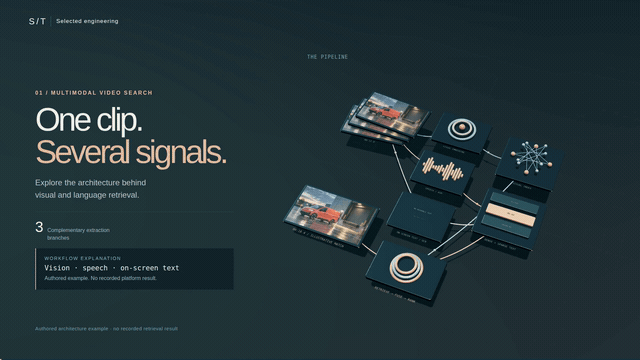

# Zakhar Pashkin — Applied Machine Learning

The source for my engineering portfolio: computer vision, document AI, agentic systems, maintained services, and released ML tools.

[Portfolio](https://zack-dev-cm.github.io/) · [Resume PDF](https://zack-dev-cm.github.io/resume/zakhar-pashkin-senior-ml-engineer.pdf) · [GitHub profile](https://github.com/zack-dev-cm)

## Selected work

- **Document AI:** document assistants with structured answers, deterministic checks, and evidence for specialist review.
- **Dermaself:** guided capture, skin-analysis models, and mobile/API integration.
- **Agnitra:** a PyPI-published SDK and CLI for model profiling and inference optimization.
- **Calorio:** a maintained Telegram nutrition service for meal logging through photos, voice, and text.
- **Engineering analysis:** professional experience with computer vision for engineering drawings and 3D geometry.
- **LigninQC:** offline reanalysis of two published lignin-chemistry cases, with source-linked tables, runnable code and explicit limits.

The site includes individual case studies, a searchable project archive, current experience, and an accessible resume. The interface is built with React, TypeScript, and Vite; static project pages and structured data keep the content readable without JavaScript.

## Selected projects in 3D

Explore the layers and architecture behind two main projects. Each has an interactive 3D model, a 30-second film with original music, a shareable GIF and a downloadable GLB.

| Agnitra · recorded model shapes | Multimodal video search · architecture |
| --- | --- |
| [](https://zack-dev-cm.github.io/docs/engineering-studies/studio.html?project=agnitra) | [](https://zack-dev-cm.github.io/docs/engineering-studies/studio.html?project=retrieval) |

Agnitra uses its public CPU profiling fixture; Video Search uses explicitly illustrative inputs. [Open the gallery](https://zack-dev-cm.github.io/docs/engineering-studies/) or [inspect the sources, models and films](public/engineering-studies/README.md).

## Development

Requires Node.js 22. Install Poppler for PDF text checks. The public source/artifact audit uses the repository's existing Node dependencies.

```bash
npm ci
npm run dev
```

Project content lives in `constants.ts`. Design rules live in `DESIGN.md`. The editable resume source and PDF generator are in [`scripts/resume/`](scripts/resume/README.md).

## Verification

```bash
npm run validate
npm run build
npm run validate:seo-aeo
PLAYWRIGHT_SKIP_BUILD=true npm run test:e2e
npm run security:gate
npm run check:links
npm run audit:public
```

`audit:public` runs source, security, metadata and catalogue/deployment checks.
Browser, link and ClawPatch/source review remain separate checks. The old
`audit:codex` command is a compatibility alias; the unavailable `codex_harness`
dependency and its score were retired. See [the audit migration](codex-docs/evals.md)
for the scope and rationale.

## Publishing

GitHub Actions builds and verifies changes on `main`, then deploys to GitHub Pages. Generated output lives in `docs/`; update the source and rebuild rather than editing those files directly. Existing project and resume links retain their compatibility aliases.

See [AGENTS.md](AGENTS.md) for the repository map and [SECURITY.md](SECURITY.md) for vulnerability reporting.
