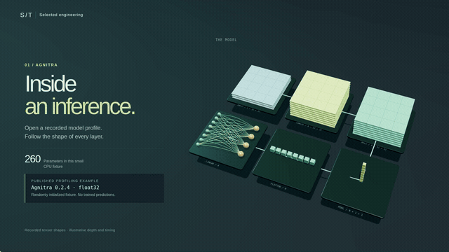

# Inside the work — selected engineering in 3D

Original 3D models, short films and shareable GIFs for two substantial portfolio projects. Explore the geometry in a browser, orbit and separate its layers, or download a self-contained GLB.

[Open the gallery](https://zack-dev-cm.github.io/docs/engineering-studies/) · [Portfolio](https://zack-dev-cm.github.io/)

## Agnitra

[](https://zack-dev-cm.github.io/docs/engineering-studies/studio.html?project=agnitra)

Follow a small CPU network through convolution, ReLU, pooling, flattening and linear projection. The layer shapes come from a saved Agnitra 0.2.4 profiling run: `1 × 3 × 32 × 32` input, eight intermediate channels, and `1 × 4` output. This randomly initialized fixture demonstrates profiling. Grid colors, depth and animation timing are illustrative; they do not show activation values, accuracy or a speedup.

[Explore in 3D](https://zack-dev-cm.github.io/docs/engineering-studies/studio.html?project=agnitra) · [1080p film with music](https://zack-dev-cm.github.io/docs/engineering-studies/media/agnitra-film.mp4) · [GIF](media/agnitra-preview.gif) · [GLB model](models/agnitra.glb) · [Case study](https://zack-dev-cm.github.io/projects/agnitra-ml-profiling-optimization/)

Sources: [recorded shapes](data/agnitra-shapes.json), [fixture reproduction](data/agnitra-reproduce.py), [PyPI release 0.2.4](https://pypi.org/project/agnitra/0.2.4/). This showcase publishes the existing public profiling fixture and original display code; the SDK's separate decoder-LLM optimization path is outside this film.

## Multimodal video search

[](https://zack-dev-cm.github.io/docs/engineering-studies/studio.html?project=retrieval)

Follow video through visual embeddings, speech and on-screen text, complementary indexes, hybrid ranking and a timestamped match. This explains the [published project architecture](https://zack-dev-cm.github.io/projects/multimodal-video-search-platform/). The red-van still is generated; the transcript, query and timestamps are authored. The still contains no readable text, so its OCR lane remains empty. Node positions are illustrative, and no computed embeddings, ranking scores or recorded retrieval result are claimed.

[Explore in 3D](https://zack-dev-cm.github.io/docs/engineering-studies/studio.html?project=retrieval) · [1080p film with music](https://zack-dev-cm.github.io/docs/engineering-studies/media/retrieval-film.mp4) · [GIF](media/retrieval-preview.gif) · [GLB model](models/retrieval.glb) · [Illustrative inputs](data/retrieval.json)

## Files and playback

Each project includes a 30-second 1920 × 1080 H.264 film at 32 fps with an original electronic score, a muted 1280 × 720 portfolio loop, a 640 × 360 GIF covering the full sequence at double speed, a poster, English caption track and GLB model. The browser tour starts silently, supports pause and chapters, and respects reduced motion. Inspection controls provide orbit, zoom, layer separation, wireframe and camera reset. Films and downloads remain available without WebGL; the gallery also works without JavaScript.

The GLB files contain their textures and named geometry. Their units and physical depth are for display; they are software explanations, not manufactured assemblies. Export sidecars bind the models to their source files. Film receipts record the renderer, source/tool hashes and all 960 rendered frames. [Provenance](data/provenance.json) binds the public inputs to their hashes.

## Reproduce

From the portfolio repository root, install Node.js 22 dependencies with `npm ci`. The media tools require FFmpeg/FFprobe and Google Chrome (`CHROME_PATH` can select another compatible Chromium executable). Three.js is vendored locally. `SOFTWARE_GL=1` selects software rendering when hardware WebGL is unavailable; renderer differences can change pixels and output hashes.

```bash
node --test scripts/media/engineering-studies/publish.test.mjs
node scripts/media/engineering-studies/export.mjs
node scripts/media/engineering-studies/capture.mjs agnitra
node scripts/media/engineering-studies/capture.mjs retrieval
node scripts/media/engineering-studies/verify-media.mjs
```

Capture freezes its browser inputs, checks successive canvas readbacks, and rejects source changes during rendering. Output files are prepared before publication, with a directory lock and rollback on a failed replacement. Capture staging is removed on success or failure. Verification checks every receipt, decodes every film and GIF in full, and rejects stale models or changed sources. Browser regression coverage lives in [`tests/engineering-media.spec.ts`](../../tests/engineering-media.spec.ts).

The soundtrack is the original **Pixel Paths** score, adapted from Vehicle Lab's procedural music. It contains no imported samples. To regenerate it, install NumPy and SciPy in a Python environment, then run:

```bash
python3 scripts/media/engineering-studies/score.py
ffmpeg -y -i public/engineering-studies/media/score.wav -c:a aac -b:a 192k public/engineering-studies/media/score.m4a
```

Regenerating the score requires recapturing both films. Its [receipt](media/score.json) records loudness, peak levels, seed and generator hash; these checks do not establish a human listening review.

## Credits and licenses

Original scene geometry, display code and films: Zakhar Pashkin, 2026, [Apache-2.0](LICENSE). The generated still reuses the original portfolio illustration documented in [project-media provenance](../artifacts/project-media/README.md); no private video, screenshots or model weights are included.

Three.js r180, OrbitControls and GLTFExporter: [MIT](vendor/THREE-LICENSE.txt). **Pixel Paths** and its Vehicle Lab procedural-score adaptation: 2026 Vehicle Lab contributors, [MIT](vendor/VEHICLE-LAB-LICENSE.txt). The original film/inspection workflow was developed for Vehicle Lab and SectionCheck.
