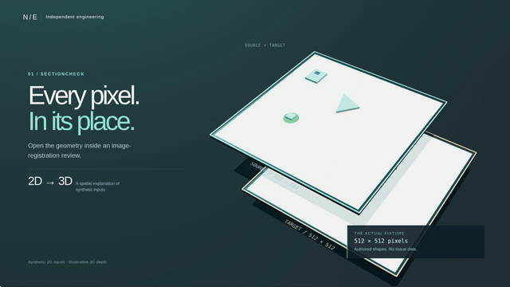
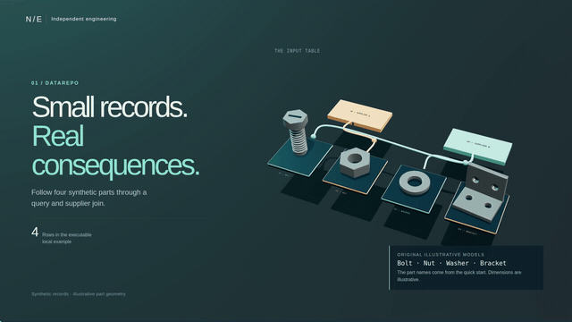

# Inside the work

Two original, interactive 3D explanations: **SectionCheck** synthetic image/ROI
review and **datarepo** query correctness. Each includes a 30-second 1080p film,
a muted 720p autoplay loop, a 15-second GIF, captions, and a glTF 2.0 model.

[Open the gallery](https://zack-dev-cm.github.io/docs/neural-engineering/index.html)
· [SectionCheck explorer](https://zack-dev-cm.github.io/docs/neural-engineering/studio.html?project=sectioncheck)
· [datarepo explorer](https://zack-dev-cm.github.io/docs/neural-engineering/studio.html?project=datarepo)

[](https://zack-dev-cm.github.io/docs/neural-engineering/studio.html?project=sectioncheck)

[](https://zack-dev-cm.github.io/docs/neural-engineering/studio.html?project=datarepo)

## Explore

Select **Inspect in 3D**, drag to orbit, and scroll or pinch to zoom. Separate
the layers or switch on wireframe. Chapter buttons jump to the corresponding
explanation. **Play tour** restores the film camera. **Reset view** restores
the current chapter's framing. Motion pauses when the tab is hidden; reduced-motion
preferences start the scene paused. Sound is opt-in.

Download [SectionCheck](models/sectioncheck.glb) or [datarepo](models/datarepo.glb)
as self-contained GLB files. Open them in a glTF-compatible viewer or Blender.
The browser viewer retains the explanatory animation; the GLBs are static,
separated inspection scenes with named objects and source facts.

## What the geometry means

SectionCheck uses the published original synthetic PNGs, exact affine matrix and
ROI coordinates, including the polygon's excluded hole and two separated regions.
The 3D extrusion and layer spacing are authored display choices. Input geometry
is **2D**, not anatomy or a reconstructed specimen. The saved source-footprint
warning, missing calibration and `decision_required` state remain visible.

The datarepo film uses the actual part names, supplier IDs and joined output from
the executable local quick start. Its null-predicate chapter uses the separate
four-row backend fixture. The bolt, nut, washer and bracket are original visual
illustrations with arbitrary dimensions, not component CAD or manufacturing files.
Tracer motion illustrates relationships; it is not database timing or throughput.

The recorded test figures describe the linked 8 September 2026 contribution
evidence. These animations do not rerun those tests. Upstream adoption, clinical
accuracy, real-data performance, researcher acceptance and human approval are not
implied. No Neuralink affiliation or endorsement.

## Sources

- [SectionCheck source snapshot](https://github.com/zack-dev-cm/sectioncheck/tree/c11ee36b86b62f5d73ace0d5029900db1c24cb08): authored images, manifest, annotations and saved review.
- [datarepo executable quick start](https://github.com/zack-dev-cm/datarepo/blob/ec6b19441c9ebe8abd8dd8a4eef3d42f71aa0927/docs/examples/local_quickstart.py): part/supplier inputs and join.
- [Null-predicate contribution and recorded results](https://github.com/zack-dev-cm/neuralink-contributions/blob/c9841dc/review/D1_PR.md).
- [Independent datarepo verification](https://github.com/zack-dev-cm/neuralink-contributions/actions/runs/34191476771).
- [SectionCheck hosted verification](https://github.com/zack-dev-cm/sectioncheck/actions/runs/34193783979).
- [Fixture provenance](data/provenance.json), [query example data](data/datarepo.json), and per-film capture receipts in `media/`.

The SectionCheck viewer verifies its copied fixture hashes before rendering.
Public source links identify exact original snapshots. Camera framing, arbitrary
display dimensions and animation timing live in `models.js` and `timeline.js`.

## Run and reproduce

The static viewer is self-contained and does not require an npm install:

```bash
python3 -m http.server 8791 --bind 127.0.0.1
```

Open the server's `index.html`. The viewer loads only same-origin local assets;
source links open the public repositories. No upload, analytics or remote model
service is used by this standalone showcase.

Reproduce models, browser checks and films with Node 22+, Chrome and FFmpeg:

```bash
git clone https://github.com/zack-dev-cm/neuralink-contributions.git
cd neuralink-contributions/showcase
npm ci
npm run check
npm run export
python3 -m venv .local/score-env
.local/score-env/bin/pip install numpy==2.4.6 scipy==1.17.1
.local/score-env/bin/python tools/score.py
ffmpeg -y -i media/score.wav -c:a aac -b:a 192k media/score.m4a
npm run capture -- sectioncheck
npm run capture -- datarepo
node tools/verify-media.mjs
```

Set `CHROME_PATH` for another Chromium executable or `SOFTWARE_GL=1` for
SwiftShader. Capture runs at 1920 × 1080, 32 fps and 128 BPM. Browser inputs are
frozen for each run. Two finished canvas readbacks must agree within strict
global and local pixel limits before the accepted frame is composited and encoded.
Receipts record source/output SHA-256 values, all 960 frame timestamps, pixel
checks, renderer and browser errors. GPU/software rasterization can differ
between hosts; byte-identical media reproduction across drivers is not promised.

GIFs play the complete 30-second sequence at twice speed in 15 seconds. Full
films retain the original speed and soundtrack. Captions are provided as WebVTT.

## Licenses

Original scene code, synthetic shapes and rendered visuals: Apache-2.0, under
the repository [license](LICENSE). Three.js r180 and its controls/exporter:
MIT, with [upstream notice](vendor/THREE-LICENSE.txt).

The score generator and strict readback comparison adapt the MIT-licensed
Vehicle Lab work, copyright 2026 Vehicle Lab contributors; its [license](vendor/VEHICLE-LAB-LICENSE.txt)
is retained. **Pixel Paths** is a new 16-bar arrangement, synthesized from
oscillators and seeded noise, without imported recordings or samples. Its
loudness and sample checks are recorded in [score.json](media/score.json).
These checks do not establish a human listening review.

Developed with AI assistance. No third-party logos, patient images, research
specimens, private planning documents or employer-owned product assets are included.
