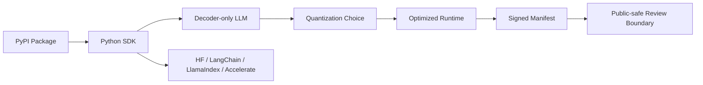

# Agnitra AI Inference Optimizer

> Public package case study for Agnitra, a Python SDK that optimizes decoder-only LLM inference through drop-in model wrapping, quantization choices, integrations, and signed inference manifests.

## Summary
Agnitra AI Inference Optimizer covers the public package surface for Agnitra: a PyPI-distributed Python SDK by Agnitra Labs for decoder-only LLM inference optimization. The public entry focuses on the package contract visible on PyPI: HuggingFace-style drop-in usage, quantization modes, integrations with HuggingFace, LangChain, LlamaIndex, accelerate, and TensorRT-LLM-shaped runtimes, CLI/API surfaces, and trust/provenance manifests. It deliberately avoids publishing unpublished source URLs, signing material, runtime hosts, customer models, unpublished benchmark claims, or configuration details from the package documentation.

## Project Link
https://zack-dev-cm.github.io/projects/agnitra-ai-inference-optimizer.md

## Key Features
- Packages decoder-only LLM inference optimization as a Python SDK with HuggingFace-style drop-in usage
- Documents quantization choices, supported decoder-LM architectures, and pass-through behavior for unsupported model families
- Includes public integration paths for HuggingFace, LangChain, LlamaIndex, accelerate, and TensorRT-LLM-shaped runtimes
- Adds trust/provenance manifest support so optimized inference artifacts can be reviewed without exposing signing material or runtime hosts
- Keeps the portfolio claim bounded to public PyPI and package metadata instead of unpublished benchmarks or source URLs

## Tech Stack
- Python
- PyTorch
- Transformers
- torchao
- HuggingFace
- LangChain
- LlamaIndex
- TensorRT-LLM
- MLOps
- LLM Inference

## Benchmarks & Analytics
- Latest public release: 0.2.4 (PyPI project page, released 2026-05-06)
- Package status: Beta (PyPI classifier: Development Status :: 4 - Beta)
- Python support: 3.8-3.12 (PyPI classifiers and requires-python metadata)
- Supported decoder families: 13 (public package description lists decoder-LM model_type families)
- Documented integrations: 5 (HuggingFace, LangChain, LlamaIndex, accelerate, and TensorRT-LLM paths in public package description)
- Public license: Apache-2.0 (PyPI project metadata)

## Links
- [Open PyPI package](https://pypi.org/project/agnitra/)
- [Open PyPI publisher profile](https://pypi.org/user/agnitra.ai/)

## Architecture Diagram

