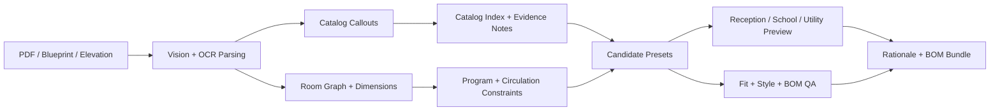

# Architectural Drawing and Interior Catalog Matching

> CV and agentic pipeline for raw plans and elevations: extract rooms and callouts, match casework and finish catalog items, and preview reception, school, or utility-building interiors.

## Summary
Architectural Drawing and Interior Catalog Matching is a public-safe case study for raw document-to-design configuration work. A 2026-06-04 source review covered plan uploads, PDF/image derivation, elevation-callout extraction, catalog-code capture, manufacturer catalog indexing, catalog mapping CSV/YAML, room-preset optimization, layout/render export, and InQI/CollectionsAI-style context routing parallels. The public entry focuses on parsing raw plans and elevations, matching rooms and callouts to catalog items, generating reception/school/utility-building interiors and exterior context previews, and exporting BOM/rationale artifacts without publishing private plans, manufacturer PDFs, addresses, client files, or proprietary SKU data.

## Project Link
https://zack-dev-cm.github.io/projects/architectural-drawing-and-interior-catalog-matching.md

## Key Features
- Parses PDFs, blueprint images, and elevation sheets into room graphs, dimensions, OCR labels, and catalog callouts
- Maps visible callout codes to casework, finish, lighting, storage, and furniture catalog records with evidence notes
- Optimizes reception and room presets against coverage, fit, style, circulation, and building-level ensemble constraints
- Exports reviewable plan previews, commercial interior/exterior context renders, BOM CSVs, and rationale packets without exposing private source documents

## Tech Stack
- Python
- OpenCV
- OCR
- PDF Processing
- LLM/Vision Parsing
- Catalog Indexing
- OpenEvolve
- BOM Export
- 3D/CV
- Visual QA

## Benchmarks & Analytics
- Input families: 3 (PDF plans, raster blueprint images, and elevation/casework sheets from source review, 2026-06-04)
- Catalog flow: callouts -> items (visible drawing codes mapped to catalog records, evidence notes, and candidate pools)
- Output artifacts: 5 (room graph, catalog mapping, layout preview, render, and BOM/rationale export)
- Public posture: sanitized (no private plans, addresses, manufacturer PDFs, raw client drawings, or proprietary SKU data published)

## Architecture Diagram

