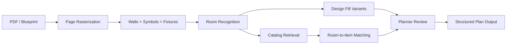

# Architectural Drawing and Interior Catalog Matching

> CV pipeline for reading architectural drawings, recognizing rooms, filling designs, and matching catalog items to each room.

## Summary
Architectural Drawing and Interior Catalog Matching extends the existing room-interior segmentation and inpainting work into building-level planning. The 2026-06-04 source review covered blueprint/floorplan notes for PDF conversion, symbol detection, structured counts with page references, and model-training interfaces, plus related notes on 3D digital replicas and object insertion from research-paper implementations. The public case study describes a privacy-safe architecture for floorplan parsing, room recognition, design filling, interior variant planning, and catalog-item matching without publishing private plans, addresses, client files, or unreleased datasets.

## Project Link
https://zack-dev-cm.github.io/projects/architectural-drawing-and-interior-catalog-matching.md

## Key Features
- Converts PDFs and blueprint images into model-ready page and symbol inputs
- Detects walls, rooms, fixtures, furniture zones, and countable blueprint symbols
- Connects recognized room types to design filling, visual variants, and catalog candidates
- Supports building-scope planning while keeping private plans and addresses out of public assets

## Tech Stack
- Python
- OpenCV
- OCR
- PDF Processing
- Object Detection
- Segmentation
- Multimodal Retrieval
- 3D/CV
- Visual QA

## Benchmarks & Analytics
- Input families: 2 (PDF floorplans and blueprint/raster plan images from source review, 2026-06-04)
- Planning scope: building-level (room recognition, design filling, and catalog matching across full plan layouts)
- Output shape: rooms + items (structured room zones, symbol counts, page references, and catalog candidates)
- Public posture: sanitized (no private floorplans, addresses, client drawings, or unreleased datasets published)

## Architecture Diagram

