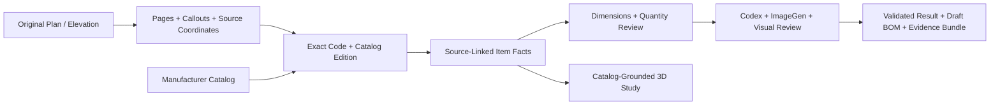

# Architectural Drawing and Interior Catalog Matching

> A working document-to-interior demo: follow real cabinet callouts through catalog matching, evidence review, ImageGen and downloadable results, with an interactive 3D companion.

## Summary
I built a pipeline for architectural plans and elevations: callout extraction, catalog indexing, exact matching and evidence review. The recovered project contains original elevation templates and a 306-page Case Systems catalog. The live demo runs a full Codex workflow from these original documents: native PDF extraction, exact family matching, agent review, a fresh ImageGen interior concept and validated exports. B3000 and B3100 have completed examples with real source crops and phase receipts; a visitor can also select a nominal width and illustrative finish for a new run. The companion 64-second 3D film follows eight distinct stages from the original drawing and extraction to the recorded render, an adjustable illustrative room fit and an evidence handoff. Installed dimensions, physical quantities, original finishes and prices remain unresolved until supported by their own evidence.

## A grounded example
B3000 appears on page 1 of the original elevation template and resolves to page 27 of the recovered catalog: one upper drawer, two hinged doors and one adjustable shelf. B3100 appears on page 3 and resolves to page 28: two side-by-side upper drawers above the same two-door lower compartment. The 3D study makes this difference visible and lets visitors open, separate and select the components.

## Dimensions and review
The initial model uses a catalog-allowed 36 W x 34 H x 24 D inch configuration. The width control explores a reviewed subset of allowed variants. Installed sizes still need drawing evidence; repeated callouts across views do not establish physical quantity. Finish, hardware and movement are illustrative. The recovered mapping also contains useful failure cases: W0100 is a two-door wall cabinet, and R1000 is a wall scribing filler.

## A functional full workflow
The live service uses Codex Mode 1 with GPT-6.1 sol and built-in ImageGen. The agent reads the original PDFs, runs extraction and matching tools, reviews the evidence, directs a new image, inspects its visible cabinet arrangement and packages the actual artifacts. Independent checks validate source hashes, chosen variants and artifact receipts before publication. The two 36-inch oak examples took 120.75 and 144.15 seconds; a live 48-inch sage B3100 run took 106.39 seconds. These are individual measured runs, not throughput or accuracy benchmarks. Completed examples remain available when the live agent is offline.

## The model evaluation plan
The next scanned-document lane evaluates PaddleOCR-VL-1.6 and Qwen3.5-9B against the original document set. Qwen3.6-27B-FP8 is a newer challenger for a separate GPU window. Exact code lookup precedes embedding retrieval, and evaluation measures source accuracy, unresolved cases and render fidelity. The current demonstration uses native PDF text and the Codex agent; local GPU models are proposed and have not been deployed by this release.

## Project Figures

Final room-fit illustration. Catalog-grounded nominal cabinet; authored room, finish and construction.

Inspect the drawer, door and shelf facts from catalog pages 27 and 28.

Recorded B3000 run: original drawing p. 1, catalog p. 27, agent review and fresh ImageGen. Illustrative oak finish; nominal 36-inch variant.

Recorded B3100 run: original drawing p. 3, catalog p. 28, agent review and fresh ImageGen. Inspect every phase and download the result in the live demo.

## Project Link
https://zack-dev-cm.github.io/projects/architectural-drawing-and-interior-catalog-matching.md

## Key Features
- Reuses original elevation and catalog documents for exact code matching with page-level evidence
- Runs actual Codex and ImageGen phases with owner-scoped exports and recorded completion receipts
- Follows eight animated stages, with original evidence, exploded inspection, recorded renders and an adjustable final room fit
- Distinguishes catalog dimensions, installed drawing dimensions and repeated-view quantities
- Carries unresolved catalog, finish, quantity and price fields into draft BOM review

## Tech Stack
- Python
- PyMuPDF
- OpenCV
- OCR
- Catalog Indexing
- Codex Mode 1
- GPT-6.1 sol
- ImageGen
- SQLite
- BOM Review
- Three.js
- glTF
- Visual QA

## Benchmarks & Analytics
- Recovered catalog: 306 pages (Original project catalog; edition retained by source hash)
- Identifier coverage: 1,639 / 1,639 (PDF/YAML identifier check, 1 October 2026; not matching accuracy)
- Grounded comparison: B3000 / B3100 (Catalog pages 27/28 and original elevation callouts)
- Completed full examples: 120.75 / 144.15 s (Measured B3000/B3100 36-inch oak runs; includes fresh ImageGen and review)
- Playable study: 8 chapters (Same procedural scene drives the interactive controls and 64-second film)

## Links
- [Run the full workflow](https://architectural-catalog-demo.arch-catalog-demo-20261001.workers.dev/)
- [Explore catalog in 3D](https://zack-dev-cm.github.io/docs/architectural-catalog/)
- [Watch the complete film](https://zack-dev-cm.github.io/docs/architectural-catalog/media/catalog-film.mp4)
- [Catalog source notes](https://zack-dev-cm.github.io/docs/architectural-catalog/sources.html)
- [Download cabinet model](https://zack-dev-cm.github.io/docs/architectural-catalog/models/catalog-cabinets.glb)
- [Case Systems catalog resources](https://www.casesystems.com/resources/design-resources/casework-catalogs/)
- [PaddleOCR-VL-1.6](https://huggingface.co/PaddlePaddle/PaddleOCR-VL-1.6)
- [Qwen3.6-27B-FP8](https://huggingface.co/Qwen/Qwen3.6-27B-FP8)

## Architecture Diagram

```mermaid
flowchart LR
  Drawing["Original Plan / Elevation"] --> Evidence["Pages + Callouts + Source Coordinates"]
  Evidence --> Lookup["Exact Code + Catalog Edition"]
  Catalog["Manufacturer Catalog"] --> Lookup
  Lookup --> Facts["Source-Linked Item Facts"]
  Facts --> Review["Dimensions + Quantity Review"]
  Review --> Render["Codex + ImageGen + Visual Review"]
  Render --> BOM["Validated Result + Draft BOM + Evidence Bundle"]
  Facts --> Preview["Catalog-Grounded 3D Study"]
```
