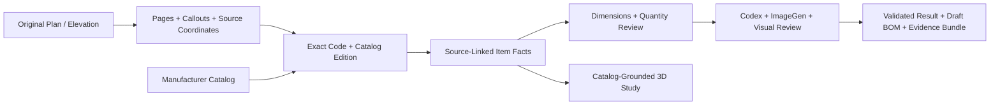

# Architectural Drawing and Interior Catalog Matching

> Upload a drawing and furniture catalog. Compare supported matches, check dimensions and see selected furniture in a furnished room. Three real source sets and an interactive 3D film show the complete flow.

## Summary
The working MVP accepts new PDF, PNG or JPEG drawings and furniture catalogs, using a Codex Mode 1 agent with GPT-6.1 sol and max reasoning to choose page searches, selective OCR, visual inspection and supported catalog candidates. The agent reviews nominal width, height and depth against optional available-space constraints, directs built-in ImageGen to stage the selected furniture in a furnished room, visually reviews the actual result and packages hash-verified artifacts. Three real source sets include an annotated Case Systems elevation with its 306-page catalog, IKEA ENHET manufacturer combinations and Herman Miller OE1 technical drawings. Manufacturer example drawings are not independent measured rooms. Unmatched items and revision conflicts stay visible. The 64-second interactive companion explains eight stages and places the cabinet between adjoining units under a continuous counter, with upper storage, a worktable, chairs and a courtyard. Exact nominal width fit, infill and a blocked oversized placement have distinct behavior. Installed geometry, quantities, prices and installation tolerances still require supporting evidence.

## A grounded example
B3000 appears on page 1 of the original elevation template and resolves to page 27 of the recovered catalog: one upper drawer, two hinged doors and one adjustable shelf. B3100 appears on page 3 and resolves to page 28: two side-by-side upper drawers above the same two-door lower compartment. The 3D study makes this difference visible and lets visitors open, separate and select the components.

## Dimensions and review
The initial model uses a catalog-allowed 36 W x 34 H x 24 D inch configuration. The width control explores a reviewed subset of allowed variants. Installed sizes still need drawing evidence; repeated callouts across views do not establish physical quantity. Finish, hardware and movement are illustrative. The recovered mapping also contains useful failure cases: W0100 is a two-door wall cabinet, and R1000 is a wall scribing filler.

## A functional full workflow
A real Codex Mode 1 CLI agent uses GPT-6.1 sol with max reasoning and the installed ImageGen, design and PDF drawing-reading skills. It chooses the matching strategy, inspects actual document pixels and native/OCR text, reviews evidence, generates a furnished-room concept and packages the result. Independent tools verify original hashes, quotations, page coordinates, nominal fit arithmetic and phase receipts. The Mac executes the agent through this project's own reverse SSH bridge; Hypnos runs the owner-scoped API without loading a GPU model. Completed examples remain available when the Mac is offline.

## Bring your files
Choose one drawing and one catalog as PDF, PNG or JPEG, up to 16 MiB each: 32 drawing pages or 500 catalog pages. Match & render validates both files and starts processing in one action. Room direction, finish and available width, height and depth are optional. Processing updates, elapsed time and completed outputs appear on the same page. An optional preview action lets you inspect the files first. Review the matches and fit, then download the room PNG, draft BOM CSV and full ZIP. Original files stay private and are excluded from exports; source access expires after 24 hours.

## Three grounded source sets
The recovered annotated Case Systems elevation includes red W0100 revisions over black W2052 labels, which require a revision check. IKEA ENHET uses actual combination drawings from the March 2026 buying guide; Herman Miller OE1 uses its actual dimension drawings and product sheet. The latter two drawings come from their respective catalog documents, so their room staging is authored rather than a recovered site measurement. The original B3000/B3100 casework walkthrough remains available beside the general workspace.

## Project Figures

Exact nominal placement between adjoining storage units, under a continuous counter. Furnished room and courtyard are authored concepts.

Inspect the drawer, door and shelf facts from catalog pages 27 and 28.

Recorded B3000 run: original drawing p. 1, catalog p. 27, agent review and fresh ImageGen. Illustrative oak finish; nominal 36-inch variant.

Recorded B3100 run: original drawing p. 3, catalog p. 28, agent review and fresh ImageGen. Inspect every phase and download the result in the live demo.

## Project Link
https://zack-dev-cm.github.io/projects/architectural-drawing-and-interior-catalog-matching.md

## Key Features
- Accepts new PDF/image drawings and catalogs with native text, selective OCR and source coordinates
- Runs actual Codex and ImageGen phases with owner-scoped exports and recorded completion receipts
- Follows eight animated stages, including a furnished room, exact nominal placement, infill and blocked insertion
- Distinguishes catalog dimensions, installed drawing dimensions and repeated-view quantities
- Carries unresolved catalog, finish, quantity and price fields into draft BOM review

## Tech Stack
- Python
- PyMuPDF
- OpenCV
- OCR
- Catalog Indexing
- Codex Mode 1
- GPT-6.1 sol
- ImageGen
- SQLite
- BOM Review
- Three.js
- glTF
- Visual QA

## Benchmarks & Analytics
- Recovered catalog: 306 pages (Original project catalog; edition retained by source hash)
- Identifier coverage: 1,639 / 1,639 (PDF/YAML identifier check, 1 October 2026; not matching accuracy)
- Grounded comparison: B3000 / B3100 (Catalog pages 27/28 and original elevation callouts)
- Completed full examples: 120.75 / 144.15 s (Measured B3000/B3100 36-inch oak runs; includes fresh ImageGen and review)
- Playable study: 8 chapters (Same procedural scene drives the interactive controls and 64-second film)

## Links
- [Run the full workflow](https://architectural-catalog-demo.arch-catalog-demo-20261001.workers.dev/workspace)
- [Explore catalog in 3D](https://zack-dev-cm.github.io/docs/architectural-catalog/)
- [Watch the complete film](https://zack-dev-cm.github.io/docs/architectural-catalog/media/catalog-film.mp4)
- [Catalog source notes](https://zack-dev-cm.github.io/docs/architectural-catalog/sources.html)
- [Download cabinet model](https://zack-dev-cm.github.io/docs/architectural-catalog/models/catalog-cabinets.glb)
- [Case Systems catalog resources](https://www.casesystems.com/resources/design-resources/casework-catalogs/)
- [PaddleOCR-VL-1.6](https://huggingface.co/PaddlePaddle/PaddleOCR-VL-1.6)
- [Qwen3.6-27B-FP8](https://huggingface.co/Qwen/Qwen3.6-27B-FP8)

## Architecture Diagram

```mermaid
flowchart LR
  Drawing["Original Plan / Elevation"] --> Evidence["Pages + Callouts + Source Coordinates"]
  Evidence --> Lookup["Exact Code + Catalog Edition"]
  Catalog["Manufacturer Catalog"] --> Lookup
  Lookup --> Facts["Source-Linked Item Facts"]
  Facts --> Review["Dimensions + Quantity Review"]
  Review --> Render["Codex + ImageGen + Visual Review"]
  Render --> BOM["Validated Result + Draft BOM + Evidence Bundle"]
  Facts --> Preview["Catalog-Grounded 3D Study"]
```
