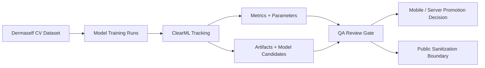

# ClearML Experiment Tracking for Dermaself

> MLOps case study for setting up ClearML tracking around Dermaself skin-analysis experiments, run metrics, and promotion gates.

## Summary
ClearML Experiment Tracking for Dermaself captures the MLOps layer behind the Dermaself skin-analysis work. The public entry focuses on setting up ClearML-backed experiment tracking for model runs, dataset and parameter hygiene, metric review, artifact boundaries, and promotion decisions around the same public-safe Dermaself CV pipeline. It deliberately avoids publishing raw skin images, private datasets, model weights, ClearML server URLs, or user-level records.

## Project Link
https://zack-dev-cm.github.io/projects/clearml-experiment-tracking-for-dermaself.md

## Key Features
- Sets up ClearML experiment tracking for Dermaself model runs without exposing private workspaces
- Keeps datasets, parameters, metrics, artifacts, and promotion decisions reviewable across CV iterations
- Separates debug or overfit experiment notes from release-ready mobile and server claims
- Keeps raw skin images, private datasets, model weights, and ClearML server URLs out of public portfolio files

## Tech Stack
- ClearML
- Python
- PyTorch
- ONNX
- TFLite
- Flutter
- Computer Vision
- MLOps
- Experiment Tracking

## Benchmarks & Analytics
- Tracking stack: ClearML (Dermaself MLOps setup added to public portfolio scope, 2026-06-09)
- Tracked surfaces: 5 (dataset, parameters, metrics, artifacts, and promotion decisions)
- Public posture: sanitized (public case study excludes raw skin photos, private datasets, model weights, and ClearML server URLs)
- Promotion boundary: review-gated (debug experiments stay separate from release-ready mobile/server claims)

## Architecture Diagram

