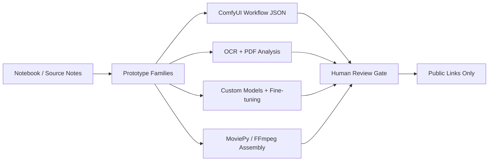

# ComfyUI and Colab Generative Prototype Lab

> Notebook and prototype archive for ComfyUI automation, custom model experiments, paper-to-code snippets, and generated media pipelines.

## Summary
ComfyUI and Colab Generative Prototype Lab adds the source-reviewed notebook and advanced prototype work that was missing from the public portfolio. The 2026-06-04 review covered Colab notebook folders, OCR and PDF-analysis demos, MMOCR notes, Falcon/LLM fine-tuning proposal notes, mobile PyTorch custom-library build notes, ComfyUI API automation, LivePortrait batch animation, MoviePy/FFmpeg assembly, and generative media pipeline planning. The public entry links only public repositories and describes the system patterns; private notebook URLs, restricted datasets, unpublished weights, and private proposal artifacts are not published.

## Project Figures

## Project Link
https://zack-dev-cm.github.io/projects/comfyui-and-colab-generative-prototype-lab.md

## Key Features
- Turns notebook experiments into reusable prototype families rather than isolated demos
- Automates ComfyUI workflow JSON through Python and WebSocket-style orchestration patterns
- Groups custom model, OCR, document QA, LLM fine-tuning, and media-assembly work under one research lab surface
- Keeps private Colab links, restricted datasets, unpublished weights, and proposal drafts out of public files

## Tech Stack
- Google Colab
- ComfyUI
- Python
- PyTorch
- MMOCR
- PaddleOCR
- LangChain
- Pinecone
- MoviePy
- FFmpeg
- LivePortrait
- WebSocket

## Benchmarks & Analytics
- Prototype lanes: 6 (ComfyUI, LivePortrait, OCR/PDF, retrieval QA, model fine-tuning, media assembly)
- Source posture: public links only (private source and Colab URLs excluded from published portfolio files)
- Notebook posture: prototype (research and implementation snippets, not presented as maintained production services)
- Review date: 2026-06-04 (private-source and local portfolio review for missing notebook/prototype work)

## Links
- [Digits recognition MMOCR](https://github.com/ZackPashkin/digits-recognition-mm-ocr)
- [Voice and lip sync Colab app](https://github.com/ZackPashkin/voice-and-lip-sync-in-pytorch-web-app-colab)
- [Text to cartoon CLIP](https://github.com/ZackPashkin/text2cartoon-pytorch-CLIP)

## Architecture Diagram

