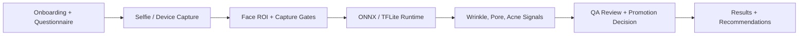

# Dermaself Flutter Skin Analysis App

> Flutter mobile app case study for a guided cosmetic skin-analysis flow with Firebase-backed account, intake, photo capture, and results screens.

## Summary
Dermaself is a mobile CV case study organized as a native Flutter experience for Android and iOS, with a guided path from account setup through onboarding, questionnaire intake, selfie/device photo capture, analysis results, and home navigation. The engineering signal is the mobile architecture, Firebase integration, offline model runtime, ROI gating, tile-bounded wrinkle and fine-line processing, pore detection, and promotion decisions for a camera-heavy cosmetic analysis workflow.

## Project Link
https://zack-dev-cm.github.io/projects/dermaself-flutter-skin-analysis-app.md

## Key Features
- Structures the app into clean feature modules for auth, onboarding, questionnaire, photo capture, device capture, analysis, and home
- Uses Firebase services for account state, database records, image storage, analytics, messaging, and serverless extension points
- Builds a guided capture-to-results UX for camera-heavy cosmetic analysis without presenting the portfolio entry as a medical diagnostic claim
- Includes offline model runtime, ROI gating, and tile-bounded wrinkle/fine-line processing in the mobile delivery path
- Keeps debug-only segmentation evidence separate from launch claims when a model should not be promoted

## Tech Stack
- Flutter
- Dart
- Firebase
- Riverpod
- GoRouter
- ONNX
- TFLite
- Mobile CV
- iOS
- Android

## Benchmarks & Analytics
- Native targets: 2 (Android and iOS app structure)
- Feature modules: 7 (auth, onboarding, questionnaire, photo capture, device capture, analysis, home)
- Debug Dice ceiling: 0.975 mean (12-image overfit diagnostic, not holdout evidence, 2026-05-12)
- Promotion decision: blocked (fine-line model not promoted to server or Flutter after QA review)

## Architecture Diagram

