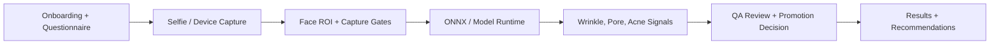

# Dermaself Flutter Skin Analysis App

> Skin-analysis computer vision for Dermaself, connecting guided mobile capture with pore and wrinkle segmentation and usable results.

## Summary
I develop Dermaself's cosmetic skin-analysis computer vision, spanning guided capture, facial regions, pore and wrinkle segmentation, model evaluation and mobile/API integration. The work joins PyTorch and OpenMMLab model development with ONNX and Flutter delivery. I resolved model-asset and runtime differences across cloud and GPU deployments, restoring matching segmentation outputs in regression comparisons. Capture quality, runtime behavior and reproducible evaluation guide model release decisions.

## Project Figures

## Project Link
https://zack-dev-cm.github.io/projects/dermaself-flutter-skin-analysis-app.md

## Key Features
- Guided capture and facial-region processing for consistent model input
- Pore and wrinkle segmentation with reproducible model evaluation
- Mobile and API integration across Flutter, ONNX and cloud services
- Matching regression outputs across cloud and GPU runtimes

## Tech Stack
- Flutter
- Dart
- Firebase
- Riverpod
- GoRouter
- ONNX
- Mobile CV
- iOS
- Android

## Architecture Diagram

