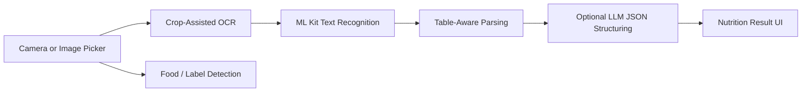

# Food Recognition App

> iOS SwiftUI prototype for food detection and nutrition-label OCR with crop-assisted text extraction and structured results.

## Summary
Mobile CV prototype for food recognition and nutrition-label scanning. The public case study focuses on camera/image-picker flows, ML Kit text recognition, crop-assisted OCR toggles, nutrition-label detection calls, table extraction, and optional LLM structuring into user-readable JSON.

## Project Link
https://zack-dev-cm.github.io/projects/food-recognition-app.md

## Key Features
- Camera and gallery capture flows
- Crop-assisted nutrition label OCR
- Optional LLM result structuring
- Table-aware extraction path

## Tech Stack
- SwiftUI
- AVFoundation
- ML Kit
- OCR
- Nutrition Label Parsing
- LLM Structuring

## Architecture Diagram

