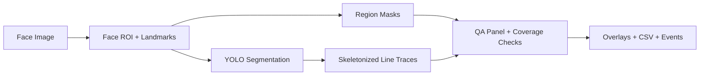

# Full-Face Wrinkle and Skin Texture Segmentation Lab

> Cosmetic face-texture pipeline with region masks, YOLO segmentation, skeletonized wrinkle traces, overlays, and visual quality gates.

## Summary
Full-Face Wrinkle and Skin Texture Segmentation Lab is a deep learning case study for cosmetic face analysis. It segments face and neck regions, runs YOLO segmentation for wrinkle and fine-line masks, remaps detections from face ROI crops back to full-resolution coordinates, skeletonizes individual line traces, and writes overlays, region masks, CSV records, timing events, and QA panels. The public entry avoids medical claims and treats quality gates as review signals rather than deployment claim.

## Project Figures

## Project Link
https://zack-dev-cm.github.io/projects/full-face-wrinkle-and-skin-texture-segmentation-lab.md

## Key Features
- Segments cosmetic face and neck regions before wrinkle/fine-line analysis
- Uses YOLO segmentation masks and skeletonized line traces instead of generic image filters
- Writes reviewable overlays, region masks, per-line CSV records, timing events, and QA panels
- Keeps quality gates advisory so weak detections are reviewed instead of silently shipped

## Tech Stack
- Python
- YOLO
- MediaPipe
- OpenCV
- ONNX
- Segmentation
- Visual QA

## Benchmarks & Analytics
- Face regions: 9 (forehead, t-area, nose, eyes, nasolabial, cheeks, mouth, mental, neck)
- Artifact families: 6 (overlays, masks, skeletons, CSV, events, QA panels)
- Gate posture: advisory (review signal, not automatic deployment claim)

## Architecture Diagram

