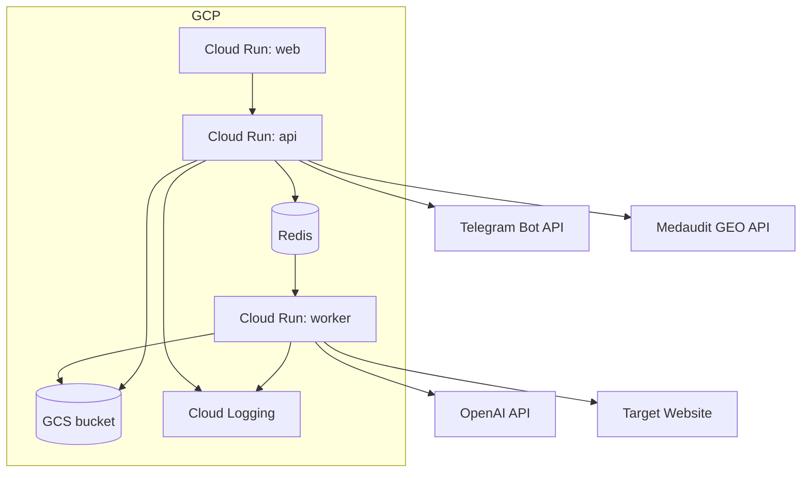

# GeoFix - AI Visibility Memorizer Mini App

> Telegram mini app that scans a website for AI visibility and generates llms.txt, llms-full.txt, and JSON-LD for bot delivery.

## Summary
GeoFix runs AI visibility scans, surfaces a scorecard with GEO diagnostics, and generates Server-Side Memorizer assets (llms.txt, llms-full.txt, schema.jsonld). The unified Cloud Run service ships a React web app, FastAPI API, and Celery worker with Redis-backed jobs, plus Telegram bot delivery and hosted previews.

## Project Figures

## Project Link
https://zack-dev-cm.github.io/projects/geofix-ai-visibility-memorizer-mini-app.md

## Key Features
- AI visibility scorecard with GEO diagnostics
- Memorizer generation for llms.txt, llms-full.txt, and schema.jsonld
- Telegram bot delivery with hosted previews
- Unified Cloud Run deployment for web, API, and worker services

## Tech Stack
- React
- TypeScript
- Vite
- Python
- FastAPI
- Celery
- Redis
- OpenAI API
- Telegram Web Apps
- Cloud Run
- GCS

## Benchmarks & Analytics
- Generated assets: 3 (llms.txt, llms-full.txt, schema.jsonld)
- Cloud Run services: 3 (web, API, worker)
- Delivery channels: 2 (web previews + Telegram mini app)
- External integrations: 4 (OpenAI, Telegram, target site, Medaudit GEO API)

## Links
- [Open Telegram Mini App](https://t.me/geofix_app_bot/launch)

## Architecture Diagram

