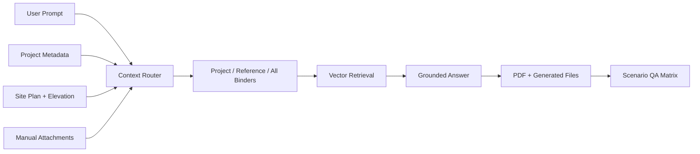

# InQuest Project Binder RAG QA

> Project-aware RAG QA matrix for parcel context, site-plan data, binders, generated files, and media attachments.

## Summary
InQuest Project Binder RAG QA captures the work behind InQuest/INQI Quest operation logic. A 2026-06-04 source review covered an operation-logic matrix for project metadata, site-plan data, elevation data, Project Binder, Reference Binder, All Projects Binder, vector-store retrieval, manual attachment priority, generated-file saving, PDF export, media attachments, and web-search toggles. The public case study turns that into a product-engineering surface for QA design, context routing, binder persistence, and public-safe evaluation without exposing project files, account data, private locations, or raw generated outputs.

## Project Link
https://zack-dev-cm.github.io/projects/inquest-project-binder-rag-qa.md

## Key Features
- Defines context precedence across project metadata, site-plan objects, elevation data, and manual attachments
- Tests Project Binder, Reference Binder, and All Projects Binder retrieval modes
- Covers save-to-binder behavior for PDFs, generated files, and media attachment outputs
- Separates public QA architecture from private client files, locations, and generated artifacts

## Tech Stack
- RAG
- Vector Stores
- OpenAI APIs
- Project Context
- Binder Workflows
- PDF Generation
- S3
- QA Matrix
- Web Search

## Benchmarks & Analytics
- QA matrix: 20+ scenarios (InQuest operation-logic spreadsheet checked 2026-06-04)
- Context modes: 3 binders (Project Binder, Reference Binder, and All Projects Binder toggles)
- Site context: parcel + elevation (project metadata, raw site-plan objects, and elevation-data checks)
- Public posture: sanitized (no private project files, account data, locations, or raw outputs published)

## Architecture Diagram

