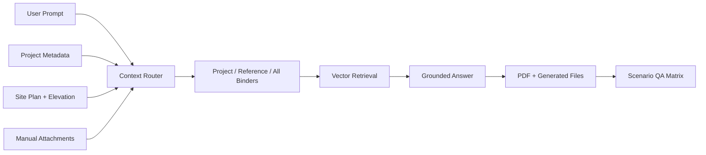

# InQuest Project Binder RAG QA

> Document agents that retrieve across project collections, preserve task context and save generated artifacts back to the right project.

## Summary
I built project-aware document-agent workflows for InQuest. Context routing distinguishes the active project, reference collections and manually attached documents, with retrieval grounded in the selected sources. OpenAI Agents SDK and MCP connect tool calls, handoffs and persistent context. Generated files and answers stay associated with the relevant project, while evaluation scenarios check retrieval selection and save behavior.

## Project Figures

## Project Link
https://zack-dev-cm.github.io/projects/inquest-project-binder-rag-qa.md

## Key Features
- Project-aware retrieval and attachment precedence
- Tool calls and handoffs with persistent task context
- Generated files saved to the relevant project collection
- Evaluation of retrieval selection and artifact persistence

## Tech Stack
- RAG
- Vector Stores
- OpenAI APIs
- Project Context
- Binder Workflows
- PDF Generation
- S3
- QA Matrix
- Web Search

## Architecture Diagram

