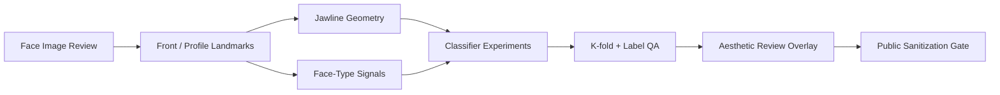

# Jaw and Face-Type Classifier for Aesthetic Review

> Computer-vision review system for jaw and face-type classification in beauty and plastic-surgery examination workflows.

## Summary
Jaw and Face-Type Classifier for Aesthetic Review is a public-safe case study for facial morphology classification work. A 2026-06-04 private-source review covered jaw-class workspaces, jaw database materials, k-fold experiment folders, label text files, and a Jaw / Face-type analyser v0.12.7 deck. The public entry focuses on the engineering pattern: dataset and label QA, front/profile landmark handling, jawline and face-type classification, review overlays, experiment tracking, and release-ready privacy boundaries. It is framed as aesthetic-review decision support, not diagnosis, treatment planning, or a surgical recommendation system; raw face images, patient data, and private model weights are not published.

## Project Figures

## Project Link
https://zack-dev-cm.github.io/projects/jaw-and-face-type-classifier-for-aesthetic-review.md

## Key Features
- Combines front and profile facial review surfaces with jawline and facial landmark overlays
- Treats label QA and class taxonomy as first-class work before model comparison
- Uses k-fold experiment structure for repeatable classifier review instead of one-off screenshots
- Keeps private raw images, patient data, and model weights out of public portfolio artifacts

## Tech Stack
- Python
- PyTorch
- OpenCV
- Computer Vision
- Facial Landmarks
- Classification
- K-fold Validation
- Visual QA

## Benchmarks & Analytics
- Review deck: v0.12.7 (Jaw / Face-type analyser project deck checked 2026-06-04)
- Experiment pattern: k-fold (classifier experiment folder review, 2026-06-04)
- Reviewed references: 5+ (jaw-class workspaces, jaw database, analyzer deck, labels, and experiment folders)
- Public posture: sanitized (no raw patient images, private labels, or model weights published)

## Architecture Diagram

