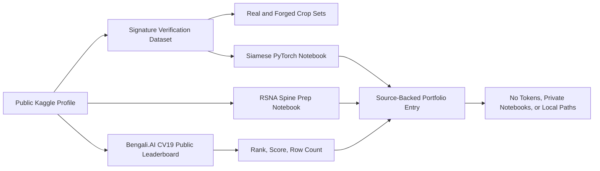

# Kaggle Dataset and Notebook Contributions

> Public Kaggle contribution surface for dataset curation, CV notebooks, and competition evidence.

## Summary
Kaggle Dataset and Notebook Contributions collects the public tienen profile work into one source-backed portfolio entry: the CC0 handwritten-signature verification dataset, public Siamese-signature and RSNA spine notebook surfaces, and a Bengali.AI CV19 public leaderboard record. The case study is deliberately bounded to public Kaggle pages and downloaded leaderboard data; it does not publish Kaggle API keys, hidden notebooks, private datasets, local paths, or unsupported rank/medal claims.

## Project Link
https://zack-dev-cm.github.io/projects/kaggle-dataset-and-notebook-contributions.md

## Key Features
- Publishes a public Kaggle dataset surface for handwritten signature verification with real/forged crop categories and TSV correspondence files
- Links public computer-vision notebook work for Siamese signature classification and RSNA 2022 spine data preparation
- Adds Bengali.AI CV19 public leaderboard evidence with exact public-row count and score context
- Separates public Kaggle contribution evidence from API-token setup notes, hidden notebooks, local paths, or private datasets
- Uses generated realistic media only as non-factual visual support; metrics remain in audited portfolio copy

## Tech Stack
- Kaggle
- Datasets
- Computer Vision
- PyTorch
- Siamese Networks
- Signature Verification
- Medical Imaging
- Bengali OCR
- Google Colab

## Benchmarks & Analytics
- Dataset downloads: 4,387 (Kaggle Dataset interactionStatistic for handwritten-signature-verification, fetched 2026-06-11)
- Dataset views: 19,113 (Kaggle Dataset interactionStatistic, fetched 2026-06-11)
- Dataset likes: 33 (Kaggle Dataset interactionStatistic, fetched 2026-06-11)
- Dataset version: v8 (Kaggle Dataset schema, modified 2022-02-07)
- Signature samples: 5,626 (2,913 real and 2,713 forged signatures in the public Kaggle dataset description)
- Leaderboard record: 687 / 2,060 (Bengali.AI CV19 public leaderboard download, score 0.9703, TeamMemberUserNames=tienen, fetched 2026-06-11)
- Public posture: token-free (no Kaggle API keys, hidden notebooks, local paths, or private data are published)

## Links
- [Kaggle profile](https://www.kaggle.com/tienen)
- [Handwritten signature dataset](https://www.kaggle.com/datasets/tienen/handwritten-signature-verification)
- [Siamese signature notebook](https://www.kaggle.com/code/tienen/signature-classification-using-siamese-pytorch)
- [RSNA spine subset notebook](https://www.kaggle.com/code/tienen/quick-prepare-small-subset-rsna2022-spine-data)
- [Bengali.AI CV19 leaderboard](https://www.kaggle.com/c/bengaliai-cv19/leaderboard)

## Architecture Diagram

