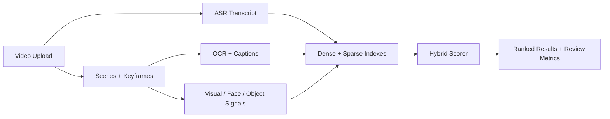

# Multimodal Video Search Platform

> Video search case study combining keyframes, ASR/OCR, object and face signals, visual embeddings, transcript embeddings, and hybrid retrieval.

## Summary
I designed retrieval across video and rich media using complementary visual and language signals. The R&D pipeline normalizes uploads, extracts keyframes, transcribes speech, reads on-screen text and computes visual and text embeddings. Dense and sparse indexes feed hybrid ranking, while regression comparisons help evaluate signal coverage and failure recovery.

## Project Link
https://zack-dev-cm.github.io/projects/multimodal-video-search-platform.md

## Key Features
- Keyframes, speech transcripts, OCR and scene information
- Visual and text embeddings for complementary retrieval signals
- Dense and sparse search with hybrid ranking
- Regression comparisons for retrieval coverage and recovery

## Tech Stack
- Python
- FastAPI
- Qdrant
- Postgres
- CLIP
- OCR
- ASR
- Hybrid Search
- Celery

## Architecture Diagram

