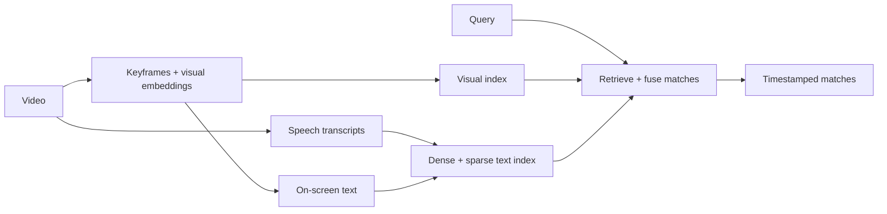

# Multimodal Video Search Platform

> Video search case study combining keyframes, ASR/OCR, object and face signals, visual embeddings, transcript embeddings, and hybrid retrieval.

## Summary
I designed retrieval across video and rich media using complementary visual and language signals. The R&D pipeline normalizes uploads, extracts keyframes, transcribes speech, reads on-screen text and computes visual and text embeddings. Dense and sparse indexes feed hybrid ranking, while regression comparisons help evaluate signal coverage and failure recovery.

## Follow a query through the architecture
The interactive 3D model and 30-second film follow video frames through visual, speech and OCR signals, complementary indexes, hybrid ranking and a timestamped match. Inspect and separate the stages or download the GLB. The red-van still is generated, and the query, transcript and timestamps are authored examples. The still contains no readable text, so its OCR lane stays empty. Index positions and the match explain the architecture; they are not computed embeddings or recorded retrieval results.

## Project Figures

Illustrative query, AI-generated scene and authored timestamp. This is a workflow explanation, not a recorded retrieval result.

Workflow diagram of parallel extraction, indexing and hybrid retrieval.

## Project Link
https://zack-dev-cm.github.io/projects/multimodal-video-search-platform.md

## Key Features
- Keyframes, speech transcripts, OCR and scene information
- Visual and text embeddings for complementary retrieval signals
- Dense and sparse search with hybrid ranking
- Regression comparisons for retrieval coverage and recovery

## Tech Stack
- Python
- FastAPI
- Qdrant
- Postgres
- Visual Embeddings
- OCR
- ASR
- Hybrid Search
- Celery

## Links
- [Explore in 3D](https://zack-dev-cm.github.io/docs/engineering-studies/studio.html?project=retrieval)
- [Watch the 30-second film](https://zack-dev-cm.github.io/docs/engineering-studies/media/retrieval-film.mp4)
- [Download 3D model](https://zack-dev-cm.github.io/docs/engineering-studies/models/retrieval.glb)
- [3D source and GIF on GitHub](https://github.com/zack-dev-cm/zack-dev-cm.github.io/tree/main/public/engineering-studies#multimodal-video-search)

## Architecture Diagram

