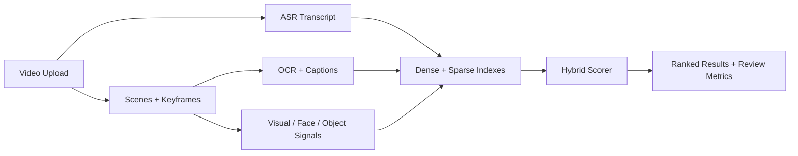

# Multimodal Video Search Platform

> Video search case study combining keyframes, ASR/OCR, object and face signals, visual embeddings, transcript embeddings, and hybrid retrieval.

## Summary
Multimodal Video Search Platform is a case study for search across video and rich media. The system normalizes uploads, extracts keyframes, runs transcript and OCR processing, maintains visual and text embeddings, writes dense and sparse indexes, and serves ranked results through calibrated hybrid retrieval. The public entry focuses on architecture, agent responsibilities, benchmark posture, and recovery paths using sanitized architecture notes.

## Project Link
https://zack-dev-cm.github.io/projects/multimodal-video-search-platform.md

## Key Features
- Combines keyframe extraction, ASR/OCR, visual embeddings, transcript embeddings, object signals, and face signals
- Uses dense vector retrieval and sparse search together instead of relying on a single modality
- Adds quality-agent style regression checks for hybrid retrieval, ASR/OCR coverage, and recovery workflows
- Uses sanitized architecture diagrams, metrics posture, and recovery notes for public review

## Tech Stack
- Python
- FastAPI
- Qdrant
- Postgres
- CLIP
- OCR
- ASR
- Hybrid Search
- Celery

## Benchmarks & Analytics
- Signal lanes: 5 (keyframes, ASR, OCR, objects, faces)
- Index types: 2 (dense vector and sparse retrieval)
- Agent roles: 5 (ingestion, embedding, retrieval, quality, recovery)
- Metric posture: sample benchmark (regression signal, not production accuracy claim)

## Architecture Diagram

