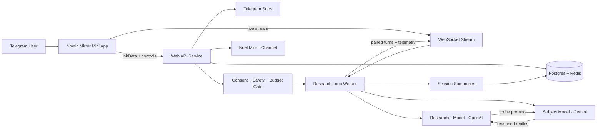

# Noel - Noetic Mirror

> Live Telegram mini app streaming a researcher/subject AI loop with Stars-powered interventions, consent gates, and real-time telemetry.

## Summary
Noetic Mirror runs a live research loop between two models: a Researcher (OpenAI) that synthesizes prior turns and telemetry into probing prompts, and a Subject (Gemini) that returns long-context reasoning plus self-reported tags. Each paired turn is gated by consent, safety, and budget checks, logged to Postgres/Redis, and streamed to the Telegram mini app with diagnostics, session summaries, and EN/RU plus light/dark themes. Users can sponsor interventions with Telegram Stars while the admin controls adjust model versions, pacing, and thresholds.

## Project Link
https://zack-dev-cm.github.io/projects/noel-noetic-mirror.md

## Key Features
- Two-model loop with explicit roles and paired turns (Researcher probes, Subject reasons)
- Live stream with turn pairing, diagnostics, and session telemetry
- Consent, safety, and budget gates before each intervention
- Telegram Stars sponsorships and paid interventions
- EN/RU localization with light/dark theme toggle
- Admin controls for model versions, pacing, and stream settings

## Tech Stack
- React
- TypeScript
- Telegram Web Apps
- Vite
- Node.js
- Express
- WebSocket
- Postgres
- Redis
- Cloud Run
- OpenAI API
- Gemini API

## Benchmarks & Analytics
- As of: 2026-02-13 (GitHub snapshot)
- GitHub stars: 0
- Open issues: 0
- Last push: 2026-01-30

## Links
- [Open Telegram Mini App](https://t.me/noetic_mirror_bot/app)
- [Telegram Channel](https://t.me/noel_mirror)
- [View on GitHub](https://github.com/zack-dev-cm/noel)

## Architecture Diagram

