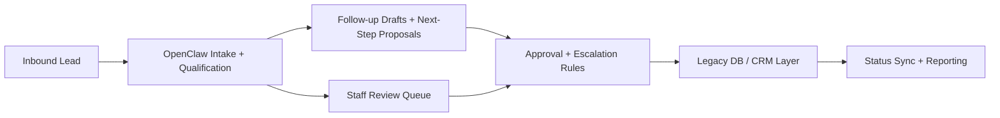

# OpenClaw Sales Manager Automation for a Multi-Clinic Chain

> Anonymized clinic-chain case study: OpenClaw-driven sales automation layered onto a legacy database with human approvals.

## Summary
I built a sales-manager automation layer for a large clinic network that needed AI assistance without replacing its legacy back office. The system used OpenClaw-driven automation to qualify inbound leads, draft follow-ups, surface next actions to staff, and sync approved state changes back into the existing database layer. The public case study focuses on the delivery pattern, approval controls, and legacy-system fit.

## Project Link
https://zack-dev-cm.github.io/projects/openclaw-sales-manager-automation-for-a-multi-clinic-chain.md

## Key Features
- OpenClaw-driven lead qualification, follow-up drafting, and next-step recommendations
- Legacy DB bridge that preserved the existing clinic back office instead of forcing a rewrite
- Human-in-the-loop approval rules for escalations and appointment routing
- Public case study framed around the reusable delivery pattern, approval controls, and legacy-system fit

## Tech Stack
- OpenClaw
- LLM Orchestration
- Legacy DB Integration
- Workflow Automation
- Human Review Tooling

## Benchmarks & Analytics
- Workflow stages: 7 (lead, intake, drafts, approval, review, legacy, reporting)
- Back-office rewrites: 0 (existing clinic system preserved)
- Human control points: 3 (approvals, escalations, routing)

## Architecture Diagram

