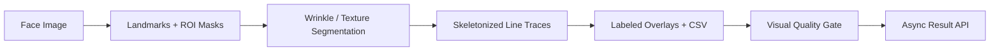

# Pores & Wrinkles Detection Service

> Face texture analysis service that detects pores and wrinkles and returns labeled overlays and metrics.

## Summary
Cosmetic face-texture pipeline using face landmarks, region masks, segmentation-based wrinkle and fine-line detection, skeletonized line traces, overlays, per-line CSV outputs, timing events, and visual quality gates. The public case study avoids diagnostic claims and focuses on the engineering path from image capture to reviewable overlays.

## Project Link
https://zack-dev-cm.github.io/projects/pores-wrinkles-detection-service.md

## Key Features
- MediaPipe landmark-based ROI extraction and face-region masks
- Segmentation-based wrinkle and fine-line tracing with skeleton overlays
- Async job API with progress + results endpoints
- Flutter demo client and Telegram Mini App UI for cosmetic analysis review

## Tech Stack
- Python
- FastAPI
- MediaPipe
- YOLO
- ONNX
- Cloud Run
- Flutter
- MLflow

## Benchmarks & Analytics
- API endpoints: 8 (/, /app, /tma, /v1/*, /healthz)
- Tasks: 3 (pores, wrinkles, pores+wrinkles)
- Image types: 5 (jpeg/png/webp/tiff/bmp)
- Default imgsz: 1280 (segment endpoint default)

## Architecture Diagram

