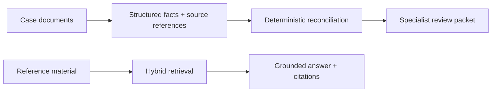

# Riverstart Document AI

> R&D for source-linked specialist review: document extraction, deterministic checks and retrieval over reference material.

## Summary
As Senior ML Engineer in Riverstart's R&D ML team, I develop a document assistant for specialist review workflows. The R&D work evaluates local language models, hybrid retrieval and agent orchestration for document collections. My scope includes extraction contracts, retrieval design, deterministic reconciliation, evaluation and deployment controls. Results retain source citations and pass through expert review; the work is an R&D system with staged validation.

## Engineering decisions
Document extraction produces structured facts and source references for deterministic reconciliation and a specialist review packet. A separate retrieval path supplies reference passages for grounded answers. These paths have different contracts and evaluations; the diagram keeps them separate.

## Evaluation and current stage
The work is in staged R&D validation. My scope includes extraction contracts, retrieval experiments and versioned evaluations, with observability and rollback around deployment candidates. Source traceability and specialist review are part of acceptance.

## Project Figures

Workflow diagram. Case checking and reference retrieval are distinct R&D paths.

## Project Link
https://zack-dev-cm.github.io/projects/riverstart-document-ai.md

## Key Features
- Hybrid retrieval over document and relationship indexes
- Structured extraction and deterministic reconciliation
- Source citations and expert review of generated results
- Versioned evaluations, observability and rollback

## Tech Stack
- Python
- LangGraph
- LangChain
- Pydantic
- Qdrant
- Neo4j
- Local LLMs
- FastAPI

## Architecture Diagram

