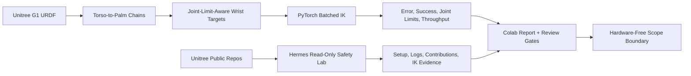

# Unitree G1 Colab IK

> Public robotics lab for hardware-free Unitree G1 inverse-kinematics benchmarks and safety-reviewed agent prompts.

## Summary
Unitree G1 Colab IK is a public GitHub-backed robotics lab for checking G1 arm inverse-kinematics behavior before any physical robot workflow. The repo uses Google Colab and PyTorch to parse the upstream Unitree G1 URDF, solve batched wrist IK targets, report mean/p95/max position error, success rate, joint-limit violations, and throughput, and keep live-robot behavior explicitly out of scope. The companion Hermes Agent lab prepares read-only repository-analysis prompts and review artifacts for Unitree setup, log triage, and contribution scouting without treating Colab as a robot-control host.

## Project Link
https://zack-dev-cm.github.io/projects/unitree-g1-colab-ik.md

## Key Features
- Parses the upstream Unitree G1 URDF and builds torso-to-palm chains for both arms without vendoring robot assets
- Solves batched position-only wrist IK targets with PyTorch and bounded joint parameterization
- Reports mean, p95, max position error, success rate, joint-limit violations, and runtime throughput for benchmark review
- Adds Hermes Agent safety-lab prompts for read-only Unitree repository analysis, setup review, log triage, and contribution planning
- States hardware, orientation, collision, latency, controller behavior, and live teleoperation as out of scope

## Tech Stack
- Python
- PyTorch
- Google Colab
- Robotics
- Inverse Kinematics
- Unitree G1
- URDF
- Hermes Agent
- Codex Skills

## Benchmarks & Analytics
- Runtime target: GPU Colab (public README requires a CUDA runtime for the benchmark notebook)
- IK metric gates: <1 cm / >=98% (README review gate: mean wrist error below 1 cm and success rate at or above 98%)
- Safety scope: hardware-free (public README states no robot hardware, orientation, collision, latency, or controller validation)
- GitHub stars: 0 (public GitHub API snapshot, 2026-06-11)
- Last push: 2026-06-06 (public GitHub repository metadata)
- ClawHub downloads: 90 (Unitree Hermes Colab public ClawHub listing, 2026-06-11)

## Links
- [View on GitHub](https://github.com/zack-dev-cm/unitree-g1-colab-ik)
- [Run IK notebook in Colab](https://colab.research.google.com/github/zack-dev-cm/unitree-g1-colab-ik/blob/main/notebooks/unitree_g1_colab_ik_bench.ipynb)
- [Run Hermes safety lab in Colab](https://colab.research.google.com/github/zack-dev-cm/unitree-g1-colab-ik/blob/main/notebooks/unitree_hermes_agent_lab.ipynb)
- [Open ClawHub listing](https://clawhub.ai/zack-dev-cm/unitree-hermes-colab)

## Architecture Diagram

