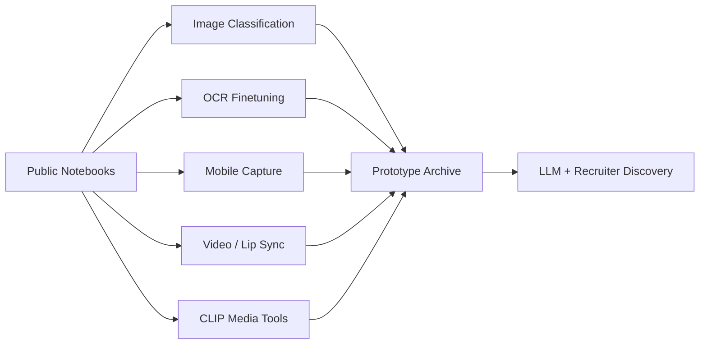

# Colab CV/DL Prototype Archive

> Legacy project URL kept for compatibility. Use the canonical project link below.

> Public notebook-style CV/DL prototype archive for Swin/CvT starters, OCR finetuning, Android document capture, video search, lip sync, and CLIP media experiments.

## Summary
Colab CV/DL Prototype Archive groups public notebook-style repositories and Colab-ready code that show research range across image classification, OCR finetuning, mobile document capture, video retrieval, lip-sync media generation, and CLIP-based creative tooling. The archive is intentionally scoped as prototype and research context: it links only public GitHub repositories and avoids unpublished notebooks, service endpoints, or restricted datasets.

## Project Figures

## Project Link
https://zack-dev-cm.github.io/projects/colab-cv-dl-prototype-archive.md

## Key Features
- Groups older public notebooks into a coherent CV/DL research surface for agents and recruiters
- Covers image classification, OCR finetuning, document capture, multimodal video search, and generative media
- Keeps notebook references tied to public GitHub repos and generated case studies
- Labels the work as prototypes so agents do not confuse notebooks with maintained production services

## Tech Stack
- Jupyter Notebook
- Google Colab
- PyTorch
- TensorFlow
- Swin Transformer
- CvT
- CLIP
- MMOCR
- OpenCV
- CameraX

## Benchmarks & Analytics
- Public prototype links: 8 (GitHub API and repo URL review, 2026-05-14)
- Research families: 5 (classification, OCR, mobile capture, video retrieval, generative media)
- Notebook posture: prototype (not presented as live service or production accuracy claim)
- Source links: public-only (GitHub repos and generated case studies only)

## Links
- [Swin transformer starter](https://github.com/ZackPashkin/swin-transformer-pytorch-starter)
- [CvT convolutional transformer starter](https://github.com/ZackPashkin/CvT-convolutional-transformer-pytorch)
- [Digits recognition MMOCR](https://github.com/ZackPashkin/digits-recognition-mm-ocr)
- [Android document scan](https://github.com/ZackPashkin/DocumentsScan)
- [Search through videos](https://github.com/ZackPashkin/search-through-videos)
- [Voice and lip sync Colab app](https://github.com/ZackPashkin/voice-and-lip-sync-in-pytorch-web-app-colab)
- [Text to cartoon CLIP](https://github.com/ZackPashkin/text2cartoon-pytorch-CLIP)
- [Sticker maker with CLIP](https://github.com/ZackPashkin/sticker-maker-flutter-app-with-OpenAI-CLIP)

## Architecture Diagram

