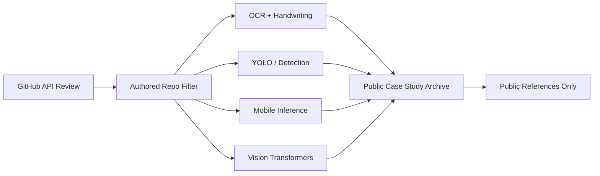

# Public CV and Deep Learning GitHub Archive

> Legacy project URL kept for compatibility. Use the canonical project link below.

> GitHub API-backed archive of public authored CV/DL repos across YOLO/EfficientNet detection, Cyrillic OCR, mobile ML Kit, TFLite, and vision-transformer prototypes.

## Summary
Public CV and Deep Learning GitHub Archive consolidates earlier public authored computer-vision repositories into one discovery surface. A 2026-05-14 GitHub API review across zack-dev-cm and ZackPashkin surfaced relevant repositories for YOLO/EfficientNet object detection, Cyrillic handwriting OCR, OCR datasets, ML Kit face contours, TFLite glasses classification, DeIT/Swin/CvT transformer prototypes, document capture, energy-meter recognition, video search, and CLIP-assisted media tools. Forked upstream reference repos are treated as research context, not as authored portfolio claim.

## Project Figures

## Project Link
https://zack-dev-cm.github.io/projects/public-cv-and-deep-learning-github-archive.md

## Key Features
- Separates authored public repos from forks and reference clones before using GitHub records
- Surfaces OCR, object detection, face landmarks, mobile inference, and vision-transformer work as one searchable archive
- Uses public repo metadata and generated case studies instead of unpublished notebook or service links
- Frames older prototypes as research and engineering breadth without claiming production deployment

## Tech Stack
- Python
- PyTorch
- TensorFlow
- YOLO
- EfficientNet
- OCR
- ML Kit
- TFLite
- OpenCV
- Android
- Flutter

## Benchmarks & Analytics
- GitHub accounts reviewed: 2 (zack-dev-cm and ZackPashkin public API snapshot, 2026-05-14)
- Public CV/DL repos sampled: 18+ (authored or project-specific public repositories, forks excluded from authored-count metrics)
- Top public repo: 14 stars / 6 forks (YOLOv3-EfficientNet-EffYolo API snapshot)
- Source posture: public-only (public GitHub repos and generated case studies only)

## Links
- [YOLOv3 EfficientNet EffYolo](https://github.com/ZackPashkin/YOLOv3-EfficientNet-EffYolo)
- [shiftlab OCR](https://github.com/ZackPashkin/shiftlab_ocr)
- [Cyrillic handwriting dataset](https://github.com/ZackPashkin/Cyrillic-Handwriting-Dataset)
- [ML Kit face contours Android](https://github.com/ZackPashkin/Snapchat-Filter-MLkit-Face-Countours-Firebase-Android)
- [TFLite glasses classifier](https://github.com/ZackPashkin/tensorflow_glasses_classifier_plus_tflite)
- [Flutter OpenCV image processing](https://github.com/zack-dev-cm/cm_cpp_flutter_opencv)
- [CV Repro Lab skill](https://github.com/zack-dev-cm/agentic-cv-repro-lab-skill)

## Architecture Diagram

