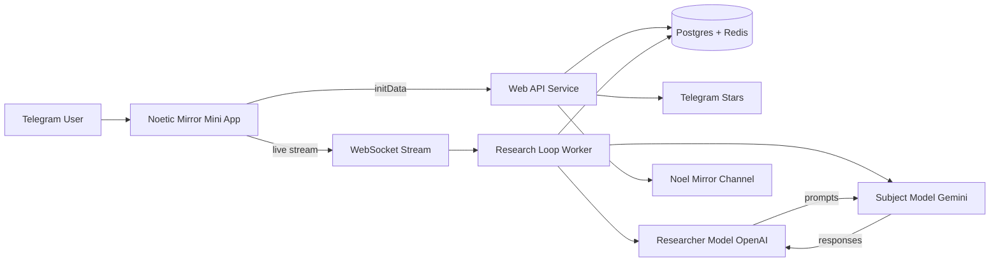

# Noel - Noetic Mirror

> Live Telegram mini app streaming a researcher/subject AI loop with Stars-powered interventions.

## Summary
Noetic Mirror runs a live research loop between two models: a Researcher (OpenAI) that crafts probing prompts and a Subject (Gemini) that responds with long-context reasoning. The loop streams to a Telegram mini app with paired turns, diagnostics, and EN/RU + light/dark themes. Users sponsor interventions with Telegram Stars while operators enforce consent, safety thresholds, and session budgets.

## Project Link
https://zack-dev-cm.github.io/projects/noel-noetic-mirror.md

## Key Features
- Two-model loop: OpenAI Researcher probes, Gemini Subject replies in paired turns
- Live stream with turn pairing, diagnostics, and session telemetry
- Telegram Stars sponsorships and paid interventions
- EN/RU localization with light/dark theme toggle
- Consent gates, safety thresholds, and budget controls
- Admin controls for model versions and stream settings

## Tech Stack
- React
- TypeScript
- Telegram Web Apps
- Vite
- Node.js
- Express
- WebSocket
- Postgres
- Redis
- Cloud Run
- OpenAI API
- Gemini API

## Links
- [Open Telegram Mini App](https://t.me/noetic_mirror_bot/app)
- [Live App](https://noetic-mirror-web-zlvmfsrm6a-ue.a.run.app/)

## Architecture Diagram

