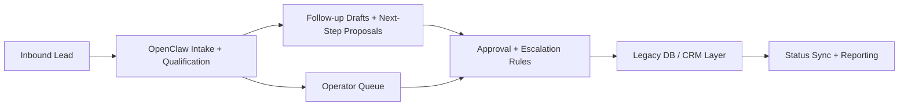

# OpenClaw Sales Manager Automation for a Multi-Clinic Chain

> Anonymized clinic-chain case study: OpenClaw-driven sales automation layered onto a legacy database and operator workflow.

## Summary
I built an anonymized sales-manager automation layer for a large multi-clinic network that needed AI assistance without replacing its legacy back office. The system used OpenClaw-driven workflows to qualify inbound leads, draft follow-ups, surface next actions to operators, and sync approved state changes back into the existing database layer. Public portfolio copy intentionally omits the client name, internal schema names, endpoint details, and any patient-identifying data while still showing the delivery scope and systems thinking behind the rollout.

## Project Link
https://zack-dev-cm.github.io/projects/openclaw-sales-manager-automation-for-a-multi-clinic-chain.md

## Key Features
- OpenClaw-driven lead qualification, follow-up drafting, and next-step recommendations
- Legacy DB bridge that preserved the existing clinic back office instead of forcing a rewrite
- Human-in-the-loop operator handoff rules for approvals, escalations, and appointment routing
- Public-safe case study with client identity, schema details, and endpoint specifics removed

## Tech Stack
- OpenClaw
- LLM Orchestration
- Legacy DB Integration
- Workflow Automation
- Operator Tooling

## Benchmarks & Analytics
- Workflow stages: 7 (lead, intake, drafts, operator, review, legacy, reporting)
- Back-office rewrites: 0 (existing clinic system preserved)
- Human control points: 3 (approvals, escalations, routing)

## Architecture Diagram

