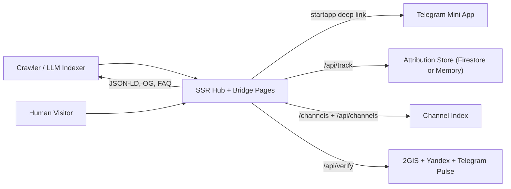

# seogeo - SEO/GEO Bridge for Telegram Mini Apps

> SSR hub + per-app bridge pages that make Telegram mini apps crawlable, track startapp opens, and power channel discovery.

## Summary
Server-rendered hub and per-app bridge pages with OG/Twitter meta, SoftwareApplication + FAQ JSON-LD, startapp deep links, and attribution tracking. Includes LLM-friendly endpoints (/api/apps, /api/memory, /llms.txt), channel index/search + import API, and optional business verification via 2GIS/Yandex plus Telegram pulse checks. Firestore is optional with an in-memory fallback.

## Project Link
https://zack-dev-cm.github.io/projects/seogeo-seo-geo-bridge-for-telegram-mini-apps.md

## Key Features
- SSR hub + per-app bridge pages with JSON-LD/OG metadata
- Startapp deep links, desktop QR, and attribution tracking
- LLM-friendly endpoints and hub memory snapshots
- Channel discovery index with search and import APIs
- Optional verification with 2GIS/Yandex + Telegram pulse

## Tech Stack
- TypeScript
- Express
- Node.js
- SSR
- Telegram Web Apps
- Firestore
- JSON-LD
- Cloud Run

## Benchmarks & Analytics
- Endpoints: 14+ (Hub, apps, channels, attribution, verify, sitemap, llms)
- Schema: SoftwareApplication + FAQ + WebSite (JSON-LD for crawlers and LLMs)
- Stores: Firestore + in-memory (Attribution + channel index fallback)

## Links
- [Open Telegram Mini App](https://t.me/se0geo_bot/app?startapp=HUB)
- [Live Hub](https://seogeo-bridge-1095464065298.us-east1.run.app)
- [Channels Index](https://seogeo-bridge-1095464065298.us-east1.run.app/channels)
- [View on GitHub](https://github.com/zack-dev-cm/seogeo)

## Architecture Diagram

